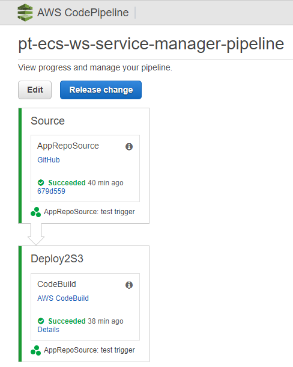

# QuickStart ECS-WORKSHOP-LANDING-ZONE

This repository can be used to create a pipeline which will deploy the whole AWS architecture for 
creating the ECS-Workshop-Landing-Zone in any AWS account.The pipeline created by this repo will 
create the project in code build so we can build products for diff services present in cf-templates folder 
present in the [ECS-Workshop-Service repo](https://github.com/Flux7Labs/ecs-workshop-service).Inside the 
ecs-workshop pipeline we have diff-diff pipeline stages which basically create the stacks for 
diff tasks, so if we want to updates stage we can do it by just updating the particular stack 
or by updating whole pipeline.

The main purpose of ecs-workshop pipeline is to create the portfolio for ecs-workshop and then create
the product for all templates available in ecs-service repo 's cf-templates like common/microservices.yml
This pipeline uses the micro-service architecture for creating the all stages and stacks.
 
## Architecture Of  ECS-Workshop-Landing-Zone

# How To Get Started:

## Prerequisites 

* We need to implement the git2s3 stack first.

  * **Git2S3**:
    
    This stack creates webhook endpoints and deploys an AWS Lambda function to push
    your code to Amazon S3 and linking our Git Repository to Amazon S3 and AWS services for continuous code 
    integration,testing, and deployment.To read about it more visit [git2s3](https://github.com/aws-quickstart/quickstart-git2s3).
     
    This stack basically integrate AWS S3 bucket to our github repo using http endpoints so whenever
    the code is updated in github repo so git webhooks will trigger lambda function which will put the updated files to 
    the output S3 bucket specified in git2s3 stack parameters. 
 
    

    In the stack parameters must sure that specify the S3 bucket name as Output S3 Bucket Name which will be used as source for code 
    pipeline code source.Git2s3 stack will create the template S3 bucket as output S3 bucket .It will upload the repo content to bucket when lambda function is
    triggered by git web hooks. 

    Physical resources created by git2s3 are following:
    * Output S3 bucket which will be used as Template bucket.
    * Git-to-amazon-s3-keybucket. 
    * Git-to-amazon-s3-lambdazipsbucket.

    Specify API Secret and in Allowed IPs specify our git ip range with cidr.OutputBucket is created by git2s3 stack.
 
    After deploying the git2s3 stack in same region where the pipeline is deployed then we need to configure
    our Git repo.We need to create a webhook in our git repo to which we want to deploy in our case it is 
    [ecs-workshop-lz](https://github.com/Flux7Labs/ecs-workshop-lz).In this webhook we need to provide the payload
    url.After deploying the git2s3 stack we get output also in output tab.In output tab we will get two api endpoints
    so copy the api endpoint from output tab acc to our use to the payload url. in our case we want to use
    GitPullWebHookApi, so copy the GitPullWebHookApi to the payload url.then copy the PublicSSHKey got from output tab in 
    your git hub ssh-keys.
 
    Now if we update our Ecs-workshop-landing-zone repo then it will create zip of our repo and upload only that part
    that is updated.  

* We need to create a key-pair for ecs cluster instance in same account and region.
 
* For create the ecs-workshop-pipeline we need to deploy the lz-pipeline.yml but before deploying this template
  we need to specify the parameter values in the config file of each respective child template.like we need to 
  specify the parameters in config_params.json file present in each product so they can be used as template 
  parameters.

* We need to specify the template parameters in following files inside cf-templates folder:
  * For ecs-cluster stage inside ecs-cluster/config_params.json.
  * For iam stage inside iam/config_params.json.
  * For network stage inside network/config_params.json.
  * For service manager stage inside service/config_params.json.

* We need to create IamRoleInstanceProfile for ecs instance, currently we are using existing "ecsInstanceRole".
* StackPrefix 's value in all config_params.json must be smaller than 30 characters.
* ServiceTemplateBucketName,ServiceArtifactBucketName,ServiceResourceBucketName
  ArtifactBucketName  must be unique because they will be created by service manager stack.
* We need to get the latest AMI id for the ecs optimized AMI and then specify it in ecs-cluster/config_params.json file.   
  

## ECS Workshop Landing Zone Deployment Process:

* After satisfying all prerequisites we first need to deploy landing-zone main stack using "lz-pipeline.yml" 
  so it will deploy the child stack or all the stacks which will deploy landing zone.When we specify parameters in 
  the landing-zone main stack so be sure that the TemplatesBucket must exist in the same region which is created
  by git2s3 stack as output S3 bucket.  
  ### ECS-Workshop-Main-Stack
  When we deploy the code pipeline template lz-pipeline.yml then it will firstly creates the following
  resources :
    * CFNRole(cloudformation role)
    * CodePipelineSNSTopic
    * Pipeline (ecs-workshop-pipeline in our case)
    * PipelineRole
  
  Inside Pipeline ecs-workshop-pipeline it will create the many stages which are as follows:
    * FetchfromGitHub.
    * IAMStackDeploy.
    * NetworkStackDeploy.
    * ECSDeployStack.
    * CreateServiceChangeSetExecution.

### ECS-Workshop pipeline with all stages:

### FetchFromGitHub Stage:
    
This stage is used by pipeline to fetch the zip of git repo from oupout S3 bucket which is create by git2s3 stack
ans this zip file is used by the code pipeline to get child template for create pipeline stages.
    
### IAMStackDeploy:
    
This stage is used by pipeline to deploy IAM satck which will create cloudformation and  ECS service role for landing zone
and also create a change set so if any change is detected by pipeline so pipeline can update the iam deploy stack.

### NetworkStackDeploy:
    
This stage is used by pipeline to deploy the network stack which will create the vpc,private and public subnets,firewall
,internet gateway,nat gateway,network acl and other networking related stuff for landing zone and also create
a network execute change set so if any change is detected by pipeline so pipeline can update the network deploy stack.

### ECSDeployStack:

This stage is used by pipeline to deploy the ECS cluster using docker container image for the landing
zone.This ECS cluster is used by code build to build our project so on every build ,code build will 
launch a container for build our project and also create a ecs execute change set so if any change is detected 
by pipeline so pipeline can update the ecs deploy stack.

### CreateServiceChangeSetExecution:

This stage is used by pipeline to deploy service manager stack which will deploy the service manager iam role
, our build project in code build and service manager pipeline in code pipeline.

#### Service Manager Pipeline

It includes two stages which are follows:
* Source
* Deploy2S3

The Source stage will get the repository from git which you want to build .
Deploy2S3 stage will use this repo as source to build the project that was created by CreateServiceChangeSetExecution 
stage in ecs workshop pipeline.

 

## Landing zone and service repo template organization:

## AWS Services used in solution:

* [EC2](https://aws.amazon.com/ec2/): EC2 to create instances for ECS cluster, Load Balancer , Target Groups,
* [Lambda](https://aws.amazon.com/lambda/): Lambda function to retrieve your code from API Gateway and to place it in Amazon S3.
* [CodeBuild](https://aws.amazon.com/codebuild/) : CodeBuild to create project and build project.
* [CodePipeline](https://aws.amazon.com/codepipeline/) : CodePipeline to create pipeline which will deploy the all stack to create landing zone and also 
                     to make the solution intelligent when ever changes are detected in respective repo in git
                     then git webhook is triggered and pipeline is updated and also all stages are also updated.
* [SNS](https://aws.amazon.com/sns/): SNS to notify about ecs pipeline to the owner of git repo and project.
* [Amazon S3](https://aws.amazon.com/s3/) : Amazon S3 to store code files like templates and lambda function and SSH private keys.
* [CloudWatch](https://aws.amazon.com/cloudwatch/): CloudWatch to store ,access and analysis logs. 
* [API Gateway](https://aws.amazon.com/api-gateway/): API Gateway to receive the webhook request from your Git service and to
                   forward it to Lambda.
* [KMS](https://aws.amazon.com/kms/): KMS is used to encrypt the Secure Shell (SSH) private key that is generated at launch. 
           The GitPull method uses the private key for SSH authentication of your Git repository.
* [IAM](https://aws.amazon.com/iam/): AWS Identity and Access Management (IAM) is a web service for securely
           controlling access to AWS services. With IAM, you can centrally manage users, security
           credentials such as access keys, and permissions that control which AWS resources
           users and applications can access.
* [AWS Auto Scaling](https://aws.amazon.com/autoscaling/): AWS Auto Scaling to scale the ECS cluster acc to build requirement and Auto Scaling 
                        Group, Launch Configurations.
* [CloudFormation](https://aws.amazon.com/cloudformation/): CloudFormation to deploy the all stacks which are initiated by pipeline.
* [Service Catalog](https://aws.amazon.com/servicecatalog): Service Catalog to create portfolio for ecs workshop and products for each
                        micro-service pipeline. 
* [VPC](https://aws.amazon.com/vpc/): VPC to create Private & Public Subnets, Route Tables,Internet Gateway, NatGateway,Security Groups
           Network ACLs. 
* [ECS](https://aws.amazon.com/ecs/): ECS to create our cluster on which we will build our project and this cluster is elastic in 
           size means can shrink and expand automatically according to need of build.  
* [ElasticLoadBalancingV2](https://aws.amazon.com/elasticloadbalancing/) : ElasticLoadBalancing to deploy load balancers to handle and distribute 
                               the load according to resource utilization. 
* [CloudTrail](https://aws.amazon.com/cloudtrail): CloudTrail to track all activity across landing zone ans also for security compliance.
* [AWS Config](https://aws.amazon.com/config/): AWS Config to enables us to assess, audit, and evaluate the configurations of our landing zone
                                                AWS resources.                            

## IAM permissions required to deploy pipeline:

* **AmazonS3FullAccess:** For uploading and sync the templates in S3 bucket.
* **AWSServiceCatalogAdminFullAccess:** For create and access portfolio and product as admin.
* **CodeBuildStandardPolicy:** For create Log Groups,Log Streams, put log events , access cloud watch logs,s3 get object 
  for access artifacts store.
* **SyncToTemplatesBucket:** For sync content between bucket and repo.
* **AmazonEC2ContainerServiceRole:**
            
  * ec2:AuthorizeSecurityGroupIngress,Describe*,
  * elasticloadbalancing:Deregister/Register InstancesFromLoadBalancer ,Deregister/Register Targets,Describe*
 
* **CloudFormationRole:** Admin inline policy.
* **Pipeline-Role (CodePipeline As Trusted Advisor):** It will give permissions to CodePipeline for following:
  * s3:*
  * codebuild:*
  * cloudformation:Create/Describe/Delete/Update Stack,
                   Create/Execute/Delete/Describe ChangeSet,
                   SetStackPolicy,
  * iam:PassRole
  * sns:Publish
  * codecommit:BatchGetRepositories,Get*,GitPull,List*,Update*,Test*,UploadArchive.
* **AmazonEC2ContainerServiceforEC2Role:**  Used as ecsInstanceRole for ecs cluster.  
  
                       
 

 

This repository contains the templates to create landing-zone resources like VPC, IAM Roles, Application loadbalancer etc

## Getting started

Deploy all the stacks here by deploying the [codepipeline.yml](https://github.com/sampritavh/ecs-workshop-lz/tree/master/cf-templates/codepipeline) cloudformation template. All the rest of the templates are deployed through this pipeline. 

The CodePipeline deploys following stacks:
1. IAM
2. Network
3. ECS Cluster
4. Service Manager Pipeline

